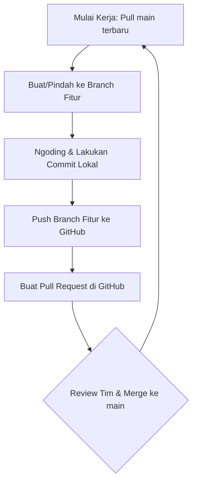

# 📘 Panduan Workflow & Version Control Git - Tim Tabkeep

Panduan ini dibuat sebagai **standar operasional (SOP) Git** untuk tim developer Tabkeep (**Muktiasa, Ariq, dan Keanu**) agar alur pengembangan kode teratur, menghindari kode yang tertimpa (*override*), dan meminimalkan konflik merge.

---

## 📌 4 Prinsip Utama Version Control Tabkeep

1. **`main` adalah Suci** 
   Jangan pernah menulis kode langsung di branch `main`. Branch `main` hanya berisi kode yang stabil, sudah dicompile tanpa error, dan siap dideploy.
2. **Satu Fitur, Satu Branch** 
   Setiap mengerjakan tugas baru, buatlah branch fitur baru (misal: `ariq`, `keanu`, atau `feat/theme-toggle`).
3. **Pull Sebelum Ngoding** 
   Sebelum menulis baris kode pertama di hari baru, selalu lakukan `git pull` agar kode lokal kamu tidak tertinggal dari perubahan terbaru teman setim.
4. **Merge Melalui Pull Request (PR) di GitHub** 
   Selalu buat Pull Request di GitHub jika ingin menggabungkan branch fitur ke `main`. Ini penting agar anggota tim lain bisa melakukan review kode sebelum digabungkan.

---

## 🔄 Diagram Alur Kerja Harian (Git Flow)



---

## 🛠️ Langkah-Langkah Teknis Alur Kerja (Step-by-Step)

### Bagian 1: Mulai Ngoding Fitur Baru

Sebelum mulai mengedit file proyek:
1. Pindah ke branch `main` dan tarik kode terbaru:
   ```bash
   git checkout main
   git pull origin main
   ```
2. Buat atau pindah ke branch kerja kamu (misal kamu menggunakan branch pribadi atau branch khusus fitur):
   ```bash
   # Jika belum membuat branch:
   git checkout -b keanu
   
   # Jika branch sudah ada:
   git checkout keanu
   ```
3. Gabungkan kode `main` terbaru ke branch kerja kamu (supaya fitur kamu tidak ketinggalan zaman):
   ```bash
   git merge main
   ```

---

### Bagian 2: Menyimpan Kode ke GitHub (Push)

Setelah selesai menulis fitur baru dan memastikan aplikasi berjalan normal tanpa error:
1. Periksa file apa saja yang berubah:
   ```bash
   git status
   ```
2. Masukkan file yang diubah ke dalam staging area:
   ```bash
   git add .
   ```
3. Lakukan commit dengan pesan yang jelas dan deskriptif:
   ```bash
   git commit -m "feat: menambah tombol copy link di popup tab picker"
   ```
4. Push (unggah) branch kamu ke GitHub:
   ```bash
   git push origin keanu
   ```

---

### Bagian 3: Menggabungkan Kode ke Branch `main` (Merge & PR)

Setelah sukses melakukan push, lakukan penggabungan lewat GitHub:
1. Buka repositori proyek di [GitHub Tabkeep](https://github.com/muktiasixs/tabkeep).
2. Klik tombol **"Compare & pull request"** yang muncul di bagian atas halaman.
3. Tulis deskripsi singkat tentang apa saja perubahan yang kamu lakukan.
4. Beri tag anggota tim lain (**Muktiasa / Ariq**) untuk meninjau kodenya.
5. Setelah disetujui (Approved), klik **"Merge pull request"** untuk menggabungkannya ke branch `main`.

---

## ⚠️ Cara Mengatasi Konflik Kode (Conflict Resolution)

Konflik terjadi jika dua orang mengedit baris kode yang sama di file yang sama secara bersamaan. Jika terjadi konflik saat merge/pull, jangan panik! Ikuti langkah berikut:

### Langkah Mengatasi Konflik Lokal:
1. Pastikan kamu tahu file mana saja yang mengalami konflik (biasanya ditandai teks merah saat `git merge` atau `git pull`).
2. Buka file berkonflik tersebut di VS Code. Git akan menandai baris konflik dengan format:
   ```text
   <<<<<<< HEAD (Kode Lokal Kamu)
   const theme = "light";
   =======
   const theme = "dark";
   >>>>>>> main (Kode dari Server GitHub)
   ```
3. Pilih salah satu kode yang benar (apakah kode kamu, kode dari server, atau gabungan keduanya), lalu **hapus tanda pemisah** `<<<<<<<`, `=======`, dan `>>>>>>>`.
4. Setelah file dirapikan, simpan file tersebut.
5. Selesaikan konflik dengan melakukan commit baru:
   ```bash
   git add .
   git commit -m "fix: menyelesaikan konflik merge pada file dashboard.tsx"
   git push origin keanu
   ```

---

## 📋 Kamus Perintah Git Penting (Cheat Sheet)

| Perintah | Fungsi | Kapan Digunakan? |
| :--- | :--- | :--- |
| `git status` | Melihat file yang dimodifikasi | Sebelum melakukan `git add` untuk verifikasi. |
| `git diff` | Melihat perubahan detail baris kode | Memeriksa perubahan kode sebelum dicommit. |
| `git checkout -b <nama-branch>` | Membuat branch baru & langsung pindah | Saat ingin memulai fitur/task baru. |
| `git checkout <nama-branch>` | Berpindah ke branch lain | Saat ingin berpindah dari `main` ke branch pribadi. |
| `git pull origin <nama-branch>` | Menarik update terbaru dari GitHub | Setiap awal memulai kerja harian. |
| `git stash` | Menyimpan perubahan sementara tanpa commit | Saat harus pull kode tapi ada perubahan lokal belum siap. |
| `git stash pop` | Mengembalikan file yang di-stash tadi | Setelah selesai melakukan pull dari server. |
