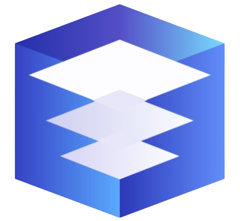

<div align="center">



# Tabkeep

Browser tab management, reimagined.

Save, organize, and revisit your browser tabs with a powerful dashboard — right inside your browser.

[](https://developer.chrome.com/docs/extensions/mv3/)
[](https://docs.plasmo.com/)
[](https://reactjs.org/)
[](https://www.typescriptlang.org/)

</div>

---

## Deskripsi

**Tabkeep** adalah ekstensi browser berbasis Chromium (Chrome, Edge, Brave, dll.) yang membantu mengelola tab secara efisien. Daripada membiarkan puluhan tab menumpuk di browser, Tabkeep memungkinkan kamu menyimpan, mengelompokkan, dan membuka kembali tab kapan saja lewat dashboard yang langsung di-pin sebagai tab pertama.

Data tab bisa di-backup ke **Google Drive** secara otomatis, jadi aman dan bisa dipulihkan di perangkat lain.

---

## Fitur Utama

### Manajemen Sesi
- Simpan tab aktif sebagai sesi — lewat popup extension atau klik kanan (context menu)
- Buka kembali sesi yang tersimpan, bisa satu tab, beberapa tab, atau seluruh sesi sekaligus
- Rename, star, sortir, duplikasi, dan merge sesi
- Drag & drop tab antar sesi, multi-select pakai `Shift+Click`

### Organisasi Folder
- Buat folder kustom untuk mengelompokkan sesi berdasarkan proyek atau topik
- Sidebar navigasi tree-view dengan drag & drop
- Sesi tanpa folder otomatis masuk ke Uncategorized

### Tampilan
- **List View** — tampilan daftar ringkas
- **Grid View** — tampilan kartu dengan thumbnail preview halaman web
- **Graph View** — visualisasi interaktif folder dan sesi (force-directed graph)

### Pinned Links
- Pin tautan penting supaya selalu terlihat di sidebar untuk akses cepat

### Pencarian
- Live search di seluruh sesi dan tab, cari berdasarkan judul atau URL

### Google Drive Sync
- Backup manual ke Google Drive satu klik
- Auto-sync dengan interval yang bisa diatur (1, 3, atau 6 jam)
- Restore data dari Google Drive — termasuk sesi, folder, pinned links, dan thumbnail

### Trash & Recovery
- Sesi yang dihapus masuk ke Trash dan bisa dipulihkan, jaga-jaga kalau salah hapus

### Pengaturan
- **Restore behavior** — tab dihapus, dipertahankan, atau diarsipkan setelah dibuka
- **Duplicate handling** — izinkan atau tolak tab duplikat
- **URL display** — tampilkan URL penuh, domain saja, singkatan, atau sembunyikan
- **Tema** — Light mode & Dark mode
- **Export/Import** data via file `.txt`

### Dashboard
- Otomatis di-pin sebagai tab pertama di browser
- Deduplikasi otomatis kalau terbuka lebih dari satu
- Screenshot tab otomatis disimpan ke IndexedDB sebagai thumbnail preview

---

## Tech Stack

| Kategori | Teknologi |
|---|---|
| **Framework** | [Plasmo](https://docs.plasmo.com/) |
| **UI** | [React 18](https://reactjs.org/) + [TypeScript 5.3](https://www.typescriptlang.org/) |
| **Styling** | [Tailwind CSS 3.4](https://tailwindcss.com/) (dark mode via `class` strategy) |
| **Icons** | [Lucide React](https://lucide.dev/) |
| **Visualisasi** | [react-force-graph-2d](https://github.com/vasturiano/react-force-graph) |
| **Storage** | Chrome Storage API + IndexedDB |
| **Cloud Sync** | Google Drive REST API via `chrome.identity` OAuth2 |
| **Build Target** | Chrome Manifest V3 (kompatibel semua browser Chromium) |

---

## Cara Menjalankan

### Prasyarat

- Node.js >= 18
- npm (atau pnpm/yarn)
- Browser berbasis Chromium (Chrome, Edge, Brave, dll.)

### 1. Clone Repository

```bash
git clone https://github.com/muktiasixs/tabkeep.git
cd tabkeep
```

### 2. Install Dependencies

```bash
npm install
```

### 3. Jalankan Development Server

```bash
npm run dev
```

Build development akan muncul di folder `build/chrome-mv3-dev`.

### 4. Load Extension ke Browser

1. Buka `chrome://extensions/` (atau `edge://extensions/`)
2. Aktifkan **Developer Mode** (toggle pojok kanan atas)
3. Klik **"Load unpacked"**
4. Pilih folder `build/chrome-mv3-dev`
5. Tabkeep akan otomatis ter-pin sebagai tab pertama

### 5. Build Produksi

```bash
npm run build
```

Hasil build ada di `build/chrome-mv3-prod`, siap di-package untuk Chrome Web Store.

### 6. Package Extension

```bash
npm run package
```

Menghasilkan file `.zip` yang siap diunggah ke web store.

---

## Struktur Proyek

```
tabkeep/
├── assets/              # Ikon dan aset statis
├── background.ts        # Service worker (tab capture, context menu, auto-sync)
├── popup.tsx            # Popup UI extension (tab picker)
├── tabs/
│   └── dashboard.tsx    # Dashboard utama (pinned tab)
├── components/
│   ├── SessionBox.tsx       # Kartu sesi
│   ├── SidebarTree.tsx      # Sidebar navigasi folder
│   ├── RightSidebar.tsx     # Sidebar kanan (preview tab)
│   ├── MainFolderAccordion.tsx
│   ├── GraphView.tsx        # Visualisasi graph
│   ├── PinnedLinks.tsx
│   ├── SettingsModal.tsx    # Pengaturan & backup
│   ├── HelpModal.tsx
│   ├── TabPickerView.tsx    # Pemilihan tab di popup
│   └── ...
├── hooks/
│   └── useTabkeepStorage.ts # Custom hook state management
├── lib/
│   ├── storage.ts       # Abstraksi Chrome Storage API
│   ├── db.ts            # IndexedDB untuk thumbnail
│   ├── gdrive.ts        # Integrasi Google Drive
│   ├── linkParser.ts    # Parser import link
│   └── navigation.ts    # Helper navigasi tab
├── types/
│   └── index.ts         # Type definitions
├── style.css
├── tailwind.config.cjs
├── tsconfig.json
└── package.json
```

---

<div align="center">
Made with care for tab hoarders everywhere.
</div>
